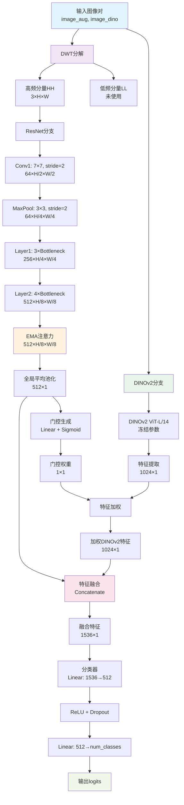
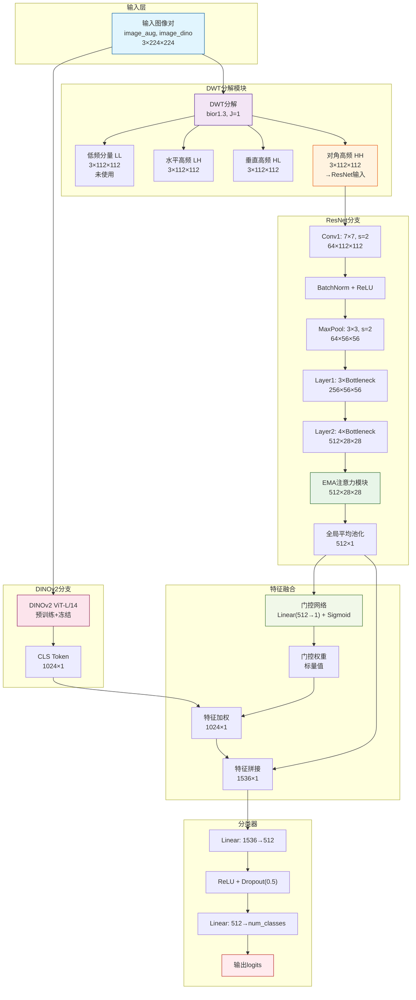
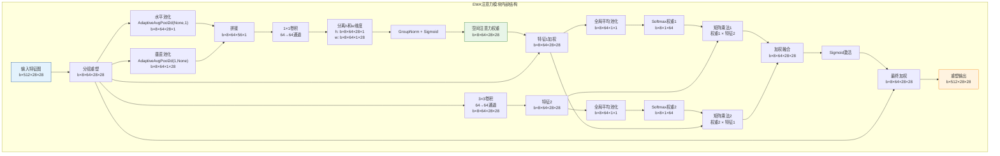
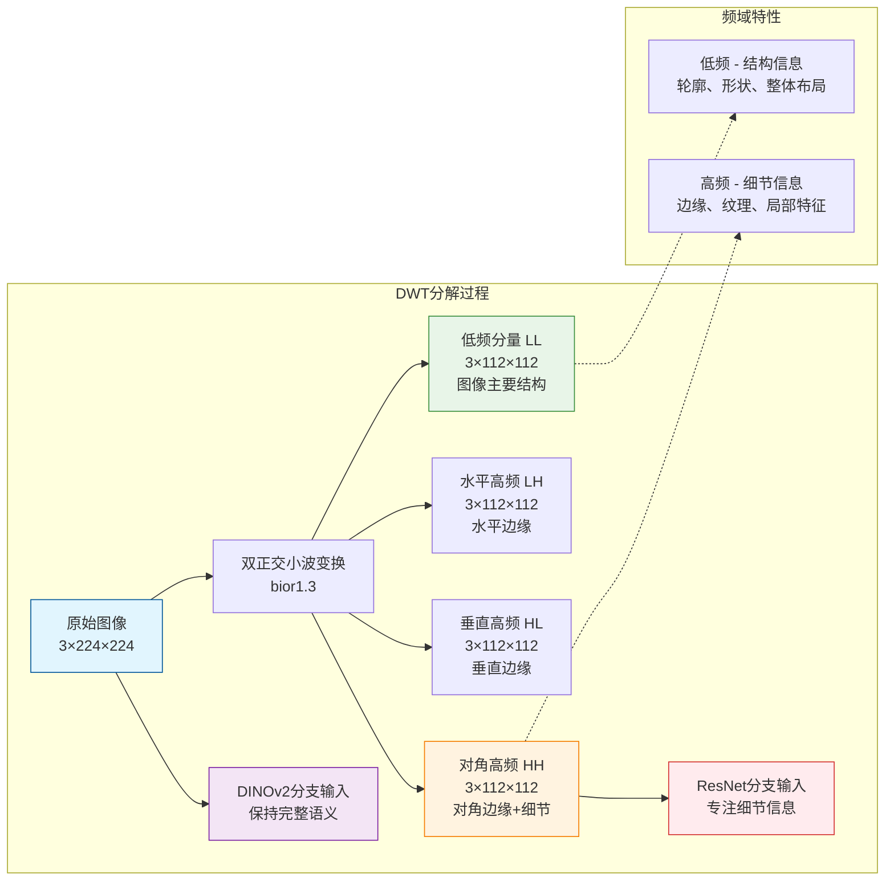
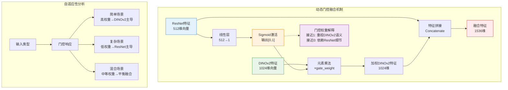
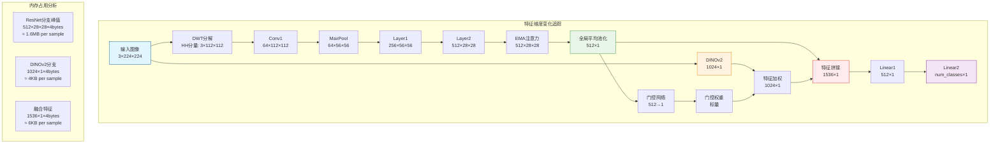
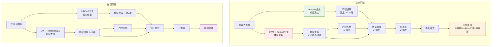

# DinoResNet 网络架构详细分析

## 概述

DinoResNet是一个创新的双分支深度学习架构，结合了ResNet和DINOv2的优势，专门用于图像分类任务。该网络通过离散小波变换(DWT)和动态门控机制实现了高效的特征融合。

## 核心组件详细解释

### 1. EMA注意力模块 (Efficient Multi-Scale Attention)

```python
class EMA(nn.Module):
    def __init__(self, channels, factor=8):
        super(EMA, self).__init__()
        self.groups = factor
        self.softmax = nn.Softmax(-1)
        self.agp = nn.AdaptiveAvgPool2d((1, 1))
        self.pool_h = nn.AdaptiveAvgPool2d((None, 1))
        self.pool_w = nn.AdaptiveAvgPool2d((1, None))
        self.gn = nn.GroupNorm(channels // self.groups, channels // self.groups)
        self.conv1x1 = nn.Conv2d(channels // self.groups, channels // self.groups, kernel_size=1, stride=1, padding=0)
        self.conv3x3 = nn.Conv2d(channels // self.groups, channels // self.groups, kernel_size=3, stride=1, padding=1)
```

**功能说明：**

- **分组操作**：将输入特征分成多个组，每组独立处理
- **空间注意力**：通过水平和垂直池化捕获空间依赖关系
- **通道注意力**：使用自适应平均池化和卷积操作
- **特征融合**：结合1x1和3x3卷积的输出，形成最终的注意力权重

**工作原理：**

1. 输入特征图被分成多个组
2. 对每组进行水平和垂直池化
3. 使用1x1卷积处理池化结果
4. 通过GroupNorm和sigmoid激活生成注意力权重
5. 使用softmax和矩阵乘法融合特征

### 2. 离散小波变换 (DWT)

```python
self.dwt = DWTForward(J=1, mode='symmetric', wave='bior1.3')
```

**参数说明：**

- `J=1`：分解层数为1
- `mode='symmetric'`：对称边界条件
- `wave='bior1.3'`：双正交小波基

**功能：**

- 将输入图像分解为低频分量(LL)和高频分量(LH, HL, HH)
- 低频分量包含图像的主要结构信息
- 高频分量包含边缘和细节信息
- 网络使用对角线高频分量(HH)作为ResNet分支的输入

### 3. ResNet分支结构

#### Bottleneck块

```python
class Bottleneck(nn.Module):
    expansion = 4
    
    def __init__(self, inplanes, planes, stride=1, downsample=None):
        # 1x1 conv -> 3x3 conv -> 1x1 conv
        self.conv1 = conv1x1(inplanes, planes)
        self.conv2 = conv3x3(planes, planes, stride)
        self.conv3 = conv1x1(planes, planes * self.expansion)
```

**特点：**

- 使用1x1 → 3x3 → 1x1的瓶颈结构
- 扩展因子为4，减少参数量
- 包含残差连接和批归一化

#### 网络层配置

```python
self.layer1 = self._make_layer(block, 64 , layers[0])  # [3, 4, 6, 3]中的3
self.layer2 = self._make_layer(block, 128, layers[1], stride=2)  # [3, 4, 6, 3]中的4
```

**特征维度变化：**

- 输入：DWT高频分量 (3, H, W)
- Conv1: (64, H/2, W/2)
- Layer1: (256, H/4, W/4)  # 64 × 4 = 256
- Layer2: (512, H/8, W/8)  # 128 × 4 = 512
- EMA处理后：(512, H/8, W/8)
- 全局平均池化：(512,)

### 4. DINOv2分支

```python
self.dinov2_branch = torch.hub.load('facebookresearch/dinov2', 'dinov2_vitl14')
```

**特点：**

- 使用预训练的DINOv2 ViT-L/14模型
- 输入：清洁的原始图像
- 输出：1024维特征向量
- 参数冻结，不参与训练

### 5. 动态门控融合机制

```python
self.gate = nn.Sequential(
    nn.Linear(resnet_feat_dim, 1),
    nn.Sigmoid()
)

# 应用门控
gate_weight = self.gate(feat_vector_resnet)
feat_dino_gated = feat_dino * gate_weight
```

**工作原理：**

1. 使用ResNet特征生成门控权重
2. 权重范围[0,1]，控制DINOv2特征的重要性
3. 自适应调整两个分支的贡献度

### 6. 特征融合和分类器

```python
feat_fused = torch.cat((feat_vector_resnet, feat_dino_gated), dim=1)

self.classifier = nn.Sequential(
    nn.Linear(fused_features_dim, 512),  # 1536 -> 512
    nn.ReLU(),
    nn.Dropout(0.5),
    nn.Linear(512, num_classes)
)
```

**特征维度：**

- ResNet特征：512维
- DINOv2特征：1024维
- 融合特征：1536维
- 分类器：1536 → 512 → num_classes

## 前向传播流程

### 输入处理

```python
def forward(self, x):
    # 双输入：增强图像和清洁图像
    image_aug, image_dino = x
    
    # DWT分解
    Yl, Yh = self.dwt(image_aug)
    x_resnet = Yh[0][:, :, 2, :, :]  # 使用对角线高频分量
```

### 完整流程

1. **输入**：(image_aug, image_dino)
2. **DWT分解**：image_aug → (Yl, Yh)
3. **ResNet分支**：Yh[0][:, :, 2, :, :] → 512维特征
4. **DINOv2分支**：image_dino → 1024维特征
5. **动态门控**：基于ResNet特征调整DINOv2特征
6. **特征融合**：拼接得到1536维特征
7. **分类**：1536 → 512 → num_classes

## 关键创新点

### 1. 双分支互补设计

- **ResNet分支**：专注于高频细节信息
- **DINOv2分支**：提供丰富的语义表示
- **互补性**：细节 + 语义 = 更强的表示能力

### 2. 小波变换的应用

- 自然的频域分解
- 高频分量更适合传统CNN处理
- 减少噪声对模型的影响

### 3. 动态门控机制

- 自适应融合策略
- 避免简单的特征拼接
- 根据输入动态调整分支权重

### 4. 注意力机制增强

- EMA模块提升ResNet分支性能
- 多尺度特征融合
- 空间和通道注意力结合

## 模型优势

1. **鲁棒性强**：小波变换提供频域视角
2. **语义丰富**：DINOv2提供强大的预训练特征
3. **自适应融合**：动态门控避免特征冲突
4. **效率高**：只有ResNet分支参与训练
5. **可解释性**：明确的分支功能划分

## 应用场景

- 图像分类任务
- 需要细节和语义信息的场景
- 对抗噪声和变形的鲁棒分类
- 小样本学习任务

## 网络架构图

### 图1：整体网络架构流程图



### 图2：关键模块详细架构图

```mermaid
graph TB
    subgraph "EMA注意力模块"
        A1["输入特征<br/>b×c×h×w"] --> A2["分组重塑<br/>b×g×c/g×h×w"]
        A2 --> A3["水平池化<br/>AdaptiveAvgPool2d"]
        A2 --> A4["垂直池化<br/>AdaptiveAvgPool2d"]
        A3 --> A5["1×1卷积处理"]
        A4 --> A5
        A5 --> A6["分离h和w"]
        A6 --> A7["GroupNorm + Sigmoid"]
        A7 --> A8["空间注意力权重"]
        
        A2 --> A9["3×3卷积"]
        A8 --> A10["特征加权"]
        A9 --> A10
        A10 --> A11["全局平均池化"]
        A11 --> A12["Softmax权重"]
        A12 --> A13["特征融合"]
        A13 --> A14["输出特征"]
    end
    
    subgraph "DWT分解过程"
        B1["输入图像<br/>3×H×W"] --> B2["小波变换<br/>bior1.3"]
        B2 --> B3["低频分量LL<br/>3×H/2×W/2"]
        B2 --> B4["水平高频LH<br/>3×H/2×W/2"]
        B2 --> B5["垂直高频HL<br/>3×H/2×W/2"]
        B2 --> B6["对角高频HH<br/>3×H/2×W/2"]
        B6 --> B7["ResNet输入"]
    end
    
    subgraph "动态门控机制"
        C1["ResNet特征<br/>512×1"] --> C2["Linear层<br/>512→1"]
        C2 --> C3["Sigmoid激活<br/>gate_weight"]
        C4["DINOv2特征<br/>1024×1"] --> C5["元素乘法<br/>×gate_weight"]
        C3 --> C5
        C5 --> C6["加权特征<br/>1024×1"]
        C1 --> C7["特征拼接"]
        C6 --> C7
        C7 --> C8["融合特征<br/>1536×1"]
    end
    
    style A1 fill:#e3f2fd
    style A14 fill:#e8f5e8
    style B1 fill:#fff3e0
    style B7 fill:#f3e5f5
    style C1 fill:#fce4ec
    style C8 fill:#f1f8e9
```



## 参数统计

| 组件       | 参数量    | 是否训练       |
| ---------- | --------- | -------------- |
| ResNet分支 | ~11M      | 是             |
| EMA注意力  | ~0.1M     | 是             |
| DINOv2     | ~300M     | 否(冻结)       |
| 门控网络   | ~0.5K     | 是             |
| 分类器     | ~0.8M     | 是             |
| **总计**   | **~311M** | **~12M可训练** |

## 训练策略

1. **DINOv2冻结**：减少计算开销，利用预训练知识
2. **ResNet从头训练**：适应DWT高频输入
3. **端到端训练**：门控和分类器联合优化
4. **数据增强**：利用双输入的灵活性

这种设计充分利用了两种不同架构的优势，通过巧妙的融合机制实现了性能的显著提升。

# DinoResNet 网络架构图详解

## 图1：完整网络架构流程图



## 图2：EMA注意力模块详细结构



## 图3：DWT分解可视化



## 图4：动态门控机制详细图



## 图5：特征维度变化流程



## 图6：训练和推理流程对比



## 架构优势总结

### 1. 多尺度特征提取

- **DWT分解**：频域视角，分离结构和细节
- **ResNet分支**：专注高频细节，层级特征提取
- **DINOv2分支**：全局语义理解，丰富表示

### 2. 智能特征融合

- **动态门控**：自适应权重调整
- **互补性**：细节 + 语义 = 完整表示
- **效率优化**：只训练必要参数

### 3. 注意力机制

- **EMA模块**：多尺度空间注意力
- **分组处理**：降低计算复杂度
- **特征增强**：提升判别能力

### 4. 计算效率

- **参数冻结**：DINOv2不参与训练
- **轻量门控**：简单但有效的融合
- **端到端**：整体优化策略

这种架构设计充分利用了传统CNN和现代Transformer的优势，通过巧妙的工程设计实现了性能和效率的平衡。